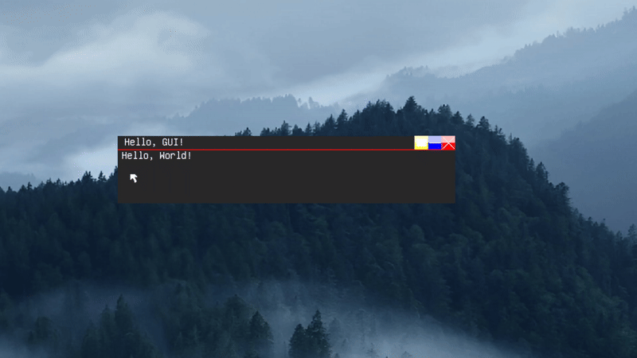

# Making a functional program
<div style="
    background-color:#004173;
    border-left: 5px solid #0066cc;
    color: #ffffff;
    border-radius: 12px;
    padding: 16px;
    margin: 16px 0;
    box-shadow: 0 2px 8px rgba(255, 255, 255, 0.1);
">
<span style="font-size:22px ; font-weight: bold;">🔷 IMPORTANT</span>

<span style="font-size:18px ; font-weight: bold;">Many of the stuff you see here will get reworked sooner or later, current priority is vulkan</span>
</div>

<span style="font-size:18px ; font-weight: bold;">Todays challange is to make a functional program, goal is to have a label, and when user presses that label color of the label changes</span>
<span style="font-size:18px ; font-weight: bold;">There are some functions we need to learn about</span>

# Messages
<span style="font-size:18px ; font-weight: bold;">Lunar uses messages to handle all window events, similar to Windows. If you ever created a windows GUI program before, this step should be familiar</span>

# Needed Functions
<span style="font-size:18px ; font-weight: bold;">There are only 5 functions needed to learn about, if you read </span> [Messages / Events](msgevent.md) <span style="font-size:18px ; font-weight: bold;">You only need to learn about 2</span>

```c
int WINEVENT(
   // no inputs
);
```

```c
int TranslateMsg(
    // no inputs
    // we get the message
);
```

```c
int GetClickedWidgetID(){
    // no inputs
    // we get the widget id when user clicks on it, if no widget is being clicked on, we get -1 (IMPORTANT)
}
```

```c
int PS2_MOUSEX(
   // no inputs, we get X coord of the mouse
);
```

```c
int PS2_MOUSEY(
   // no inputs, we get Y coord of the mouse
);
```


<span style="font-size:18px ; font-weight: bold;">When usb mouse comes we will get USB_MOUSEX/Y</span>

<span style="font-size:18px ; font-weight: bold;"></span>

<div style="
    background-color:#004173;
    border-left: 5px solid #0066cc;
    color: #ffffff;
    border-radius: 12px;
    padding: 16px;
    margin: 16px 0;
    box-shadow: 0 2px 8px rgba(255, 255, 255, 0.1);
">
<span style="font-size:22px ; font-weight: bold;">🔷 IMPORTANT</span>

<span style="font-size:18px ; font-weight: bold;">Lunar wont handle most of the messages for you, some like mouse, keyboard need to be implemented. Some that are already handled like window drawing can be also used for (example: doing something when window is drawn), not really useful but good to know</span>
</div>

# Code

<span style="font-size:18px ; font-weight: bold;">Thats all the functions we need, lets go back to our text on window program</span>

```c
void showWindow(){
    CreateWin(
    "Hello,GUI!", 
    /*default X,Y is 371/158*/ LWIN_DEFX, LWIN_DEFY, 
    500, 100,
    0x00292929, // soon outdated
    LWIN_DARKV2, // looks best in my opinion, theres LWIN_DARKV1 and LWIN_FROST
    LWIN_CLOSEMAXDRAG, // allow closing, maximizing, dragging, now we can go and disable those stuff (LWIN_CLOSEMAX) // disable drag (LWIN_CLOSEDRAG) // disable maximizing (LWIN_DRAG) // only allow drag
    0
    );

    Textout(
        "Hello, World!",
        6, 20, 
        0x00ffffff,
        1,
        0 // ID 0
    );
}
```

<span style="font-size:18px ; font-weight: bold;">We want to implement WINEVENT function! Lets do it right now</span>

```c
int WINEVENT(){
    int msg;
    int widget;
    msg = TranslateMsg();
    widget = GetClickedWidgetID();
    // switch or if, anything works really, do what you feel most comfortable with

    if(msg == 0x0010){ // MOUSE_LMBDOWN message
        // mouse LMB clicked
        // NEVER DO THIS:
        int mX = PS2_MOUSEX();
        int mY = PS2_MOUSEY();
        if(/*mX > ... && mX < ...*/){
            if(/*mY > ... && mY < ...*/){
                // clicked
            }
        }
    }
    
    // WE NEED TO RETURN 0
    return 0;
}
```
<span style="font-size:18px ; font-weight: bold;">This is the wrong implementation (^), you can do it, it will work but wastes time, instead we will take advantage of the GetClickedWidgetID like this:</span>

```c
int WINEVENT(){
    int msg;
    int widget;
    msg = TranslateMsg();
    widget = GetClickedWidgetID();
    // switch or if, anything works really, do what you feel most comfortable with

    if(widget == 0){ // if we pressed widget by the ID of 0, aka our label
        // To change color just redraw the text on a different color
        Textout("Hello, World!",6,20,0x00ff0000,1,0);
    }
    
    // WE NEED TO RETURN 0
    return 0;
}
```

