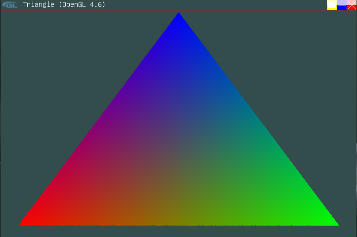
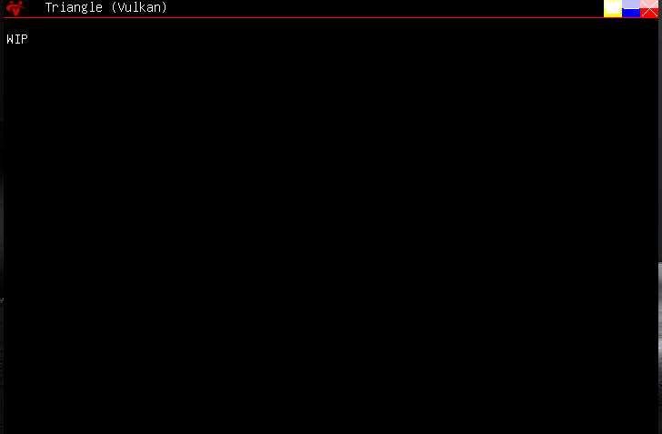

# Usage of icons for programs

<div style="
    background-color:#004173;
    border-left: 5px solid #0066cc;
    color: #ffffff;
    border-radius: 12px;
    padding: 16px;
    margin: 16px 0;
    box-shadow: 0 2px 8px rgba(255, 255, 255, 0.1);
">
<span style="font-size:22px ; font-weight: bold;">🔷 IMPORTANT</span>

<span style="font-size:18px ; font-weight: bold;">Icons are WIP; Only works on 1.0.5 and above</span>
</div>

<span style="font-size:18px ; font-weight: bold;">As of 1.0.5v Lunar supports icons for your programs, If you don't want, or can't make an icon, Lunar will use the default icon for .lex programs, if your program happens to use Vulkan/OpenGL/DepthCore you will get a default icon for that graphics API which is, their logo.</span>

## Asigning icons to programs
<span style="font-size:18px ; font-weight: bold;">To assign an icon it is very straight forward, in your program code just call this function</span>

```c
void SetWinico(
    char*       pathtoimg,
    uint64_t*   imagearray
);

```

| Argument    | Description                                                                         |
| ----------- | ----------------------------------------------------------------------------------- |
| pathtoimg   | path to a .tga (currently supported) image file, assumes path starts from root (L:\\)|
| imagearray  | **pointer** to an image array of RGBA values                                        |

<div style="
    background: rgba(247, 250, 252, 0.98);
    border: 1px solid #e2e8f0;
    border-radius: 8px;
    padding: 18px 22px;
    margin: 1.5rem 0;
    box-shadow: 0 1px 2px rgba(45, 55, 72, 0.05);
">
<span style="font-size:18px ; font-weight: bold;">Lunar assigns the icon to the currently active program, like it does with most GUI things</span>
</div>

<span style="font-size:18px ; font-weight: bold;">If you don't have a .tga image, you can pass an array of RGBA values, and Lunar will draw them accordingly. What you dont have leave as NULL,
if you specify both, both will be drawn and be overlapped.</span>

## Sizing

<span style="font-size:18px ; font-weight: bold;">Standard image size for a windows titlebar is 32x32 while its a bit resized on the Y axis, any larger image will automatically get scaled down,
currently there is no support (will be) for big icons in the file explorer</span>

<div style="display: flex;">
  
  
</div>

<span style="font-size:18px ; font-weight: bold;">Here are examples of an OpenGL program and a Vulkan program running, showcasing the icons</span>