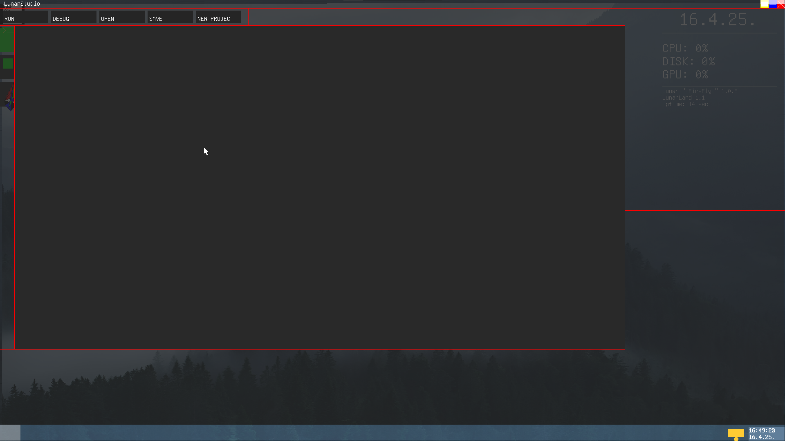
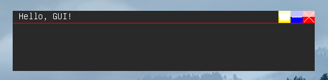

# Opening a blank window

<div style="
    background-color:#004173;
    border-left: 5px solid #0066cc;
    color: #ffffff;
    border-radius: 12px;
    padding: 16px;
    margin: 16px 0;
    box-shadow: 0 2px 8px rgba(255, 255, 255, 0.1);
">

<span style="font-size:22px ; font-weight: bold;">🔷 IMPORTANT</span>

<span style="font-size:18px ; font-weight: bold;">Make sure you are on the latest Lunar version with LunarStudio (1.0.5 and up)</span>


</div>


## Prerequisites
* ### Lunar 1.0 patch 5 and up (currently best to use: 1.0.5v)
* ### LunarStudio (preinstalled)
* ### Basic understanding of the C language

## Create a Lunar GUI Project
<span style="font-size:18px ; font-weight: bold;">Open up LunarStudio by executing "exec lstudio" from the CMD</span>
<br>

<br>
<span style="font-size:18px ; font-weight: bold;">If you already have a project, open it up, if not start typing or click on New Project and create it</span>

## Entry Point
<span style="font-size:18px ; font-weight: bold;">Lunar GUI Programs run from main function, same as console applications, we wont spend alot of time there as we will immedietly call another
function</span>

```c
int main(/*arguments*/){
    // window code
    return 0;
}
```
<span style="font-size:18px ; font-weight: bold;">We want another function that will be called,
lets name it ShowWindow, you can name it whatever you want. In there we need to call 
createWin: </span>

## CreateWin function
```c
void showWindow(){

}
```
<span style="font-size:18px ; font-weight: bold;">Careful! createWin has changed between releases of
0.0.27.0 until today (1.0.5), I will show you how to keep compatability between most of the versions</span>

```c
uint16_t CreateWin(
    char*    Name,      // title of the window              (0.0.27.0)
    int      x,         // X position                       (0.0.27.0)
    int      y,         // Y position                       (0.0.27.0)
    int      w,         // width                            (0.0.27.0) [maxWidth introduced at 80]
    int      h,         // height                           (0.0.27.0) [maxHeight introduced at 25]
    uint32_t color,     // background color of the window   (1.0v)     [soon outdated]
    uint16_t style,     // window style                     (1.0.5v)
    uint16_t type,      // window type                      (1.0v)
    uint16_t id         // window id (OUTDATED)             (1.0v)
)
```
<span style="font-size:18px ; font-weight: bold;">Currently only way to keep compatability is to use different
functions that are made for older versions</span>

```c
uint16_t CreateWin_027( // 027 aka 0.27
    char*    Name,      // title of the window              (0.0.27.0)
    int      x,         // X position                       (0.0.27.0)
    int      y,         // Y position                       (0.0.27.0)
    int      w,         // width                            (0.0.27.0) [maxWidth introduced at 80]
    int      h,         // height                           (0.0.27.0) [maxHeight introduced at 25]
)
```
<span style="font-size:18px ; font-weight: bold;">Here OS will automaticlly use LunarDark v1 theme, in 0.27 OS will use LegacyGUI theme and leave
everything (style, type) as default (type = LWIN_CLOSEMAXDRAG, style = LWIN_DARKV1) and id as NULL, please do NOT
go beyond resolution of 720x400 (80x25 text mode converted into graphics mode), 0.27 will crash!</span>

```c
uint16_t CreateWin_100( // 027 aka 0.27
    char*    Name,      // title of the window              (0.0.27.0)
    int      x,         // X position                       (0.0.27.0)
    int      y,         // Y position                       (0.0.27.0)
    int      w,         // width                            (0.0.27.0) [maxWidth introduced at 80]
    int      h,         // height                           (0.0.27.0) [maxHeight introduced at 25]
    uint32_t color,     // background color of the window   (1.0v)
    uint16_t flags,     // window flags (same as type)      (1.0v)
    uint16_t id         // window id (OUTDATED)             (1.0v)
)


```
## Code
<span style="font-size:18px ; font-weight: bold;">We will be developing for Lunar 1.0.5 so we can call the newest
function</span>

```c
void showWindow(){
    CreateWin(
    "Hello, GUI!", 
    /*default X,Y is 371/158*/ LWIN_DEFX, LWIN_DEFY, 
    500, 100,
    0x00292929, // soon outdated
    LWIN_DARKV2, // looks best in my opinion, theres LWIN_DARKV1 and LWIN_FROST
    LWIN_CLOSEMAXDRAG, // allow closing, maximizing, dragging, now we can go and disable those stuff (LWIN_CLOSEMAX) // disable drag (LWIN_CLOSEDRAG) // disable maximizing (LWIN_DRAG) // only allow drag
    0
    );
}
```
<br>

<br>
<span style="font-size:18px ; font-weight: bold;">Heres our window!</span>
<span style="font-size:18px ; font-weight: bold;">(rounded corners have been removed)</span>
<br>
<span style="font-size:18px ; font-weight: bold;">Window is automaticlly updated as OS keeps track of every made window in an array (with the id), goes trough theam and updates each one if something has changed</span>

<div style="
    background-color:#004173;
    border-left: 5px solid #0066cc;
    color: #ffffff;
    border-radius: 12px;
    padding: 16px;
    margin: 16px 0;
    box-shadow: 0 2px 8px rgba(255, 255, 255, 0.1);
">

<span style="font-size:22px ; font-weight: bold;">🔷 IMPORTANT</span>

<span style="font-size:18px ; font-weight: bold;">This may or may not change soon</span>

</div>

## Copy Paste
```c
#include <lunar.h>

void showWindow(){
    CreateWin(
    "Hello, GUI!", 
    /*default X,Y is 371/158*/ LWIN_DEFX, LWIN_DEFY, 
    500, 100,
    0x00292929, // soon outdated
    LWIN_DARKV2, // looks best in my opinion, theres LWIN_DARKV1 and LWIN_FROST
    LWIN_CLOSEMAXDRAG, // allow closing, maximizing, dragging, now we can go and disable those stuff (LWIN_CLOSEMAX) // disable drag (LWIN_CLOSEDRAG) // disable maximizing (LWIN_DRAG) // only allow drag
    0
    );
}

int main(){
    showWindow(/*if you want user customazability, here pass argc, argv... and make sure function definition uses that*/);
}

```