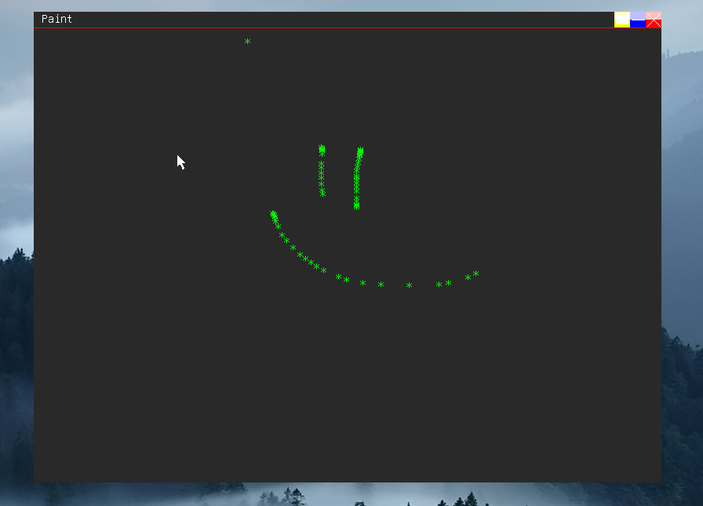

# Paint program tutorial

<span style="font-size:18px ; font-weight: bold;">I made this tutorial to showcase messages and how to use them properly, on this page we will make a simeple paint
program, we need to: </span>
* open a window
* handle MOUSE_LMBDOWN message
* "paint" by putting charachers (*)

## Opening a window
<span style="font-size:18px ; font-weight: bold;">If you followed previous pages you should already know how to open a window, if not i wont cover each function so just
copy paste the code</span>

```c
int createpaint(){
    CreateWin("Paint",0,0,800,600,0x00292929,LWIN_DARKV2,LWIN_CLOSEDRAG,0);
}

int main(){
    createpaint();
}
```
<span style="font-size:18px ; font-weight: bold;">Thats it, now we can use FillRect from DepthCore2D</span>

```c
void FillRect(){
    int      sx,    // start X position of the rect [1.0.0]
    int      sy,    // start Y position of the rect [1.0.0]
    int      ex,    // end   X position of the rect [1.0.0]
    int      ey,    // end   Y position of the rect [1.0.0]
    uint32_t color  // color of the rect            [1.0.0]
}
```

<span style="font-size:18px ; font-weight: bold;">If you are making this for earlier versions than 1.0.0, you are out of luck</span>

```c
FillRect(0,20/*20px is the titlebar height*/,800,600,0x00ffffff);
```

<span style="font-size:18px ; font-weight: bold;">Now let's setup the WINEVENT</span>

```c
int WINEVENT(){
    int m;
    m = TranslateMsg(); // get the message
    if(m == 0x0010){
        // user clicked somewhere in the window
        Textout("*",PS2_MOUSEX(),PS2_MOUSEY(),0x0000ff00,1,0);
        return 0;
    }
    return 0;
}
```

