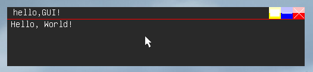

# Drawing text inside of a window

<div style="
    background-color:#004173;
    border-left: 5px solid #0066cc;
    color: #ffffff;
    border-radius: 12px;
    padding: 16px;
    margin: 16px 0;
    box-shadow: 0 2px 8px rgba(255, 255, 255, 0.1);
">

<span style="font-size:22px ; font-weight: bold;">🔷 IMPORTANT</span>

<span style="font-size:18px ; font-weight: bold;">Make sure you have knowledge of how to open a blank window, as its not covered here</span>


</div>

## Textout function
<span style="font-size:18px ; font-weight: bold;">First introduced with nightly build of 0.0.27.0 (0.0.27N), it hasnt changed since.</span>

```c
void Textout(
    char*       text,   // text to output                               [0.0.27N]
    int         x,      // x pos of the string (relative to window)     [0.0.27N]
    int         y,      // y pos of the string (relative to window)     [0.0.27N]
    uint32_t    color   // color of the string                          [0.0.27N] (doesnt do anything in 0.0.27)
);

```

<span style="font-size:18px ; font-weight: bold;">This function is 100% backwards compatible with all of Lunar releases that include GUI.</span>
<div style="
    background-color:#004173;
    border-left: 5px solid #0066cc;
    color: #ffffff;
    border-radius: 12px;
    padding: 16px;
    margin: 16px 0;
    box-shadow: 0 2px 8px rgba(255, 255, 255, 0.1);
">

<span style="font-size:22px ; font-weight: bold;">🔷 IMPORTANT</span>

<span style="font-size:18px ; font-weight: bold;">before 1.0.0, X and Y arent relative to the window, but to the screen, this was changed with the full release</span>
</div>

## Code
<span style="font-size:18px ; font-weight: bold;">We are developing on newest Lunar version, so i will use latest code for creating a window</span>

```c
void showWindow(){
    CreateWin(
    "Hello, GUI!", 
    /*default X,Y is 371/158*/ LWIN_DEFX, LWIN_DEFY, 
    500, 100,
    0x00292929, // soon outdated
    LWIN_DARKV2, // looks best in my opinion, theres LWIN_DARKV1 and LWIN_FROST
    LWIN_CLOSEMAXDRAG, // allow closing, maximizing, dragging, now we can go and disable those stuff (LWIN_CLOSEMAX) // disable drag (LWIN_CLOSEDRAG) // disable maximizing (LWIN_DRAG) // only allow drag
    0
    );

    Textout(
        "Hello, World!",
        6, 36,
        0x00ffffff
    );
}
```
<br>

<br><br>
<span style="font-size:18px ; font-weight: bold;">Parent of the text is currently active window, text is drawn by the OS going trough window's update function, goes trough all the labels in the window, draws each one. This comes with downsides and it may change in the future</span>

<div style="
    background-color:#004173;
    border-left: 5px solid #0066cc;
    color: #ffffff;
    border-radius: 12px;
    padding: 16px;
    margin: 16px 0;
    box-shadow: 0 2px 8px rgba(255, 255, 255, 0.1);
">

<span style="font-size:22px ; font-weight: bold;">🔷 IMPORTANT</span>

<span style="font-size:18px ; font-weight: bold;">This may or may not change soon</span>

</div>